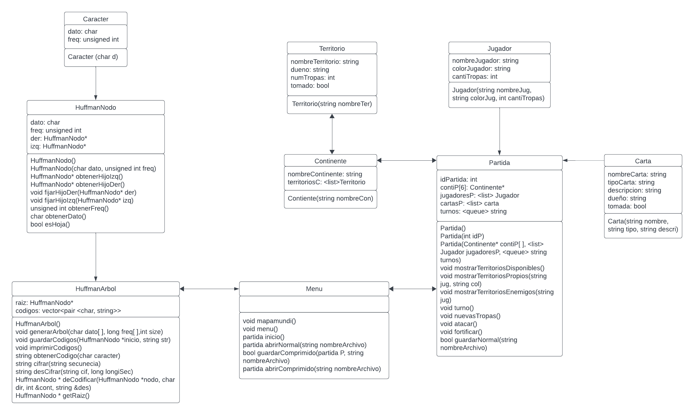

# Tads

## TAD Menu 
### Conjunto mínimo de datos
  - partidas (Partida): Lista <Partida>. Almacena todas las partidas guardadas en el menú.

### Comportamiento del objeto
  - `Mapamundi()`: Imprime el mapa mundi gráfico que representa el mapa del juego Risk.
  - `Menú()`: Despliega el menú con todas las funciones de Risk.
  - `Inicio()`: Inicia el juego donde cada jugador se crea e inicia sus territorios.
      - `Partida p = Partida(id)`
  - `abrirNormal(string nombreArchivo)`: Abre un archivo .txt donde se guardó toda la información de la partida.
  - `guardarComprimido(Partida p, string nombreArchivo)`: Guarda toda la partida en un archivo .bin.
  - `abrirComprimido(string nombreArchivo)`: Abre un archivo .bin donde se guardó toda la partida.

## TAD Partida 
### Conjunto mínimo de datos
  - Idpartida: Entero. Identificador de la partida 
  - jugadores: Lista de Jugador. Contiene todos los jugadores dentro de la partida.
  - continentes: Arreglo de tipo Continente. Representa todos los continentes presentes en la partida.
  - turnos: Cola de jugadores. Indica el orden de los turnos de los jugadores en la partida.
  - cartasp: Lista de Carta: Contiene todas las cartas presentes en la partida.
### Comportamiento del objeto
  - `Partida()` : Operación para crear una partida sin jugadores y jugadoresTurnos 
    - Post: `List<Jugador> jugadores = new List<Jugador>(0)` , `List<Stack> jugadoresTurnos` ,`List<Carta> cartas = new List< Carta >(52)` , `Continentes[6]`
  -  `Partida(int idp)` :  Operación para crear una partida con un identificador.
    - Post: `List<Jugador> jugadores = new List<Jugador>(0)` , `List<Stack> jugadoresTurnos` ,`List<Carta> cartas = new List< Carta >(52)` , `Continentes[6]` , `Idpartida = idp`
  - `Partida(Contiente* Contipa[], List <Jugador> jugadoresP, Queue<String> turnos)`: Crea la partida con datos leídos de un archivo .txt.
    - Post: `List<Jugador> jugadores =  jugadoresPa`  , `List<Stack> Turnos = turnosPa` , `Continentes[6] = ContiPa[6] `
  -  `mostrarTerritoriosDisponibles()`: Muestra todos los territorios disponibles en la partida
  -  `mostrarTerritoriosPropios(string jug)`: Muestra todos los territorios del jugador especificado.
  -  `mostrarTerritoriosEnemigos(string jug)`: Muestra todos los territorios enemigos del jugador especificado.
  -  `turno()` : Permite a un jugador realizar sus acciones durante su turno.
  -  `nuevasTropas()` : Permite que el jugador agregue nuevas tropas según el número de territorios que controle.
  -  `atacar()` : Permite que el jugador decida si quiere atacar a un territorio enemigo para conquistarlo o no.
  -  `fortificar()`: Permite al jugador fortificar un territorio con unidades de otro territorio propio.
  - `guardarNormal(string nombreArchivo)`: Guarda la partida en un archivo .txt.
    - Post: `Return` guardado

## TAD Continente 
### Conjunto mínimo de datos
  - nombreContinente : String. Nombre del continente
  - territoriosC: Lista de Territorio. Lista de territorios que se encuentran en el continente.
### Comportamiento del objeto
  - `Continente(String nombreCon)` : Constructor para crear un continente.
    - Post: `List<Territorio> territorios = new List<Territorio>(0)` , `nombreContinente = nombreCon`

## TAD Territorio 
### Conjunto mínimo de datos
  - nombreTerritorio: String. Nombre del territorio
  - numTropas: Entero. Número de tropas en el territorio.
  - duenio: String. ID del dueño de ese terrirtorio.
  - tomado: Boolean. Indica si el territorio tiene dueño o no.
### Comportamiento del objeto
  - `Territorio(String nombreTer)`: Constructor para crear un nuevo territorio.
      - Post: `Int numTropas = 0` , `nombreTerritorio = nombreTer`, `tomado = false`

## TAD Jugador 
### Conjunto mínimo de datos
  - colorJugador: String. Color del jugador dentro de la partida
  - nombreJugador: String. Identificación del jugador
  - cantiTropas: Entero. Número de tropas del jugador
### Comportamiento del objeto
  - `Jugador(String id,String color)`: Constructor para crear un jugador.
    - Pos: `nombreJugador = nombreJug`, `colorJugador = colorJug`, `cantiTropas = cantiTrop`

## TAD Carta 
### Conjunto mínimo de datos
  - NombreCarta: String. Nombre de la carta 
  - tipoCarta: String. Tipo de la carta en el juego.
  - descripcion: String. Descripción breve de la carta o una misión que el jugador debe cumplir.
  - duenio: String. Define el dueño de la carta.
  - tomado: Boolean. Indica si la carta tiene un dueño o no.
### Comportamiento del objeto

## TAD ArbolHuffman 
### Conjunto mínimo de datos
  - raiz: Puntero de tipo HuffmanNodo. Nodo raíz del árbol de Huffman.
  - codigos: Vector de pares tipo caracter y string. Nodos del árbol de Huffman, almacena los códigos Huffman.
### Comportamiento del objeto
  - `HuffmanArbol()`: Constructor del árbol de Huffman.
  - `generarArbol(char dato[], long freq[], int size)`: Se utiliza para construir el - árbol de Huffman a partir de datos de frecuencia.
  - `comparar`: Operador de comparación utilizado para la cola de prioridad.
  - `guardarCodigos(HuffmanNodo *inicio, string str)`: Genera y almacena los códigos de Huffman en el vector codigos.
  - `imprimirCodigos()`: Imprime los códigos Huffman.
  - `obtenerCodigo(char caracter)`: Devuelve el código Huffman para un carácter dado.
  - `cifrar(std::string secuencia)`: Cifra una cadena de texto utilizando los códigos Huffman.
  - `desCifrar(std::string cif, long longiSec)`: Descifra una cadena de texto utilizando los códigos de Huffman.
  - `deCodificar(HuffmanNodo *nodo, char dir, int &cont, std::string &des)`: Recibe una cadena de caracteres binarios y decodifica la secuencia mientras crea el árbol.
  - `getRaiz()`: Obtiene el nodo raíz del árbol.

## TAD NodoHuffman 
### Conjunto mínimo de datos
  - dato: Tipo caracter. Dato utilizado para el árbol de Huffman.
  - freq: Tipo entero. Frecuencia del dato, utilizado para la construcción del árbol.
  - Der: Tipo puntero de HuffmanNodo. Hijo derecho del nodo para el árbol de Huffman.
  - Izq: Tipo puntero de HuffmanNodo. Hijo Izquierdo del nodo para el árbol de Huffman.
### Comportamiento del objeto
  - `HuffmanNodo()`: Constructor vacío de nodos Huffman.
  - `HuffmanNodo(char dato, unsigned int freq)`: Constructor con dato y frecuencia para nodo Huffman.
  - `obtenerHijoIzq()`: Obtiene los punteros al hijo izquierdo del nodo.
  - `obtenerHijoDer()`: Obtiene los punteros al hijo derecho del nodo.
  - `fijarHijoDer(HuffmanNodo* der)`: Fija el puntero al hijo derecho del nodo.
  - `fijarHijoIzq(HuffmanNodo* izq)`: Fija el puntero al hijo izquierdo del nodo.
  - `obtenerFreq()`: Obtiene la frecuencia asociada al nodo.
  - `obtenerDato()`:  Obtiene el carácter almacenado en el nodo.
  - `esHoja()`: Verifica si el nodo es hoja.

## TAD Caracter 
### Conjunto mínimo de datos
  - dato: Tipo caracter. Dato utilizado para el árbol de Huffman.
  - frec: Tipo entero. Guarda la frecuencia del dato, utilizado para la construcción del árbol.
### Comportamiento del objeto
- `Caracter(char d)`: Constructor de Caracter.

# Modelo Relacional

